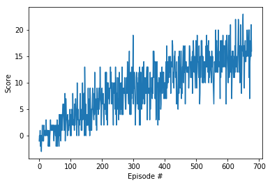
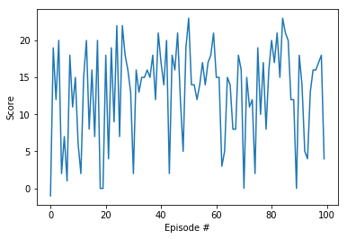

# Navigation Project Report

## Learning Algorithim

For this project, I implemented a Deep Q-Network (DQN) to solve the problem of deciding which of the available actions to
take for any given state. I used a network architecture consisting of 2 fully connected layers, each with 64 nodes.
For training, I used an Adam Optimizer with a learning rate of 5e-4. The gamma value (discount factor) for future rewards
was 0.99, and epsilon (probability of uniformly chosen action) started at 1.00 and eventually decayed to 0.01 .

## Plot of Rewards during training and evaluation

### Training of DQN-based agent, 577 episodes were need to learn acceptable level of performance

### Evaluation of DQN-based agent, after training (scores of trained agent over 100 episodes)

## Further Improvement

To further improve the performace of the network, a number of steps can be taken including:
* Training longer
* Increading the size of the fully connected layers
* Adding more fully connected layers
* Implementing Prioritized Experience Replay
* Implementing Double DQN
* Implementing Dueling Q-Network
